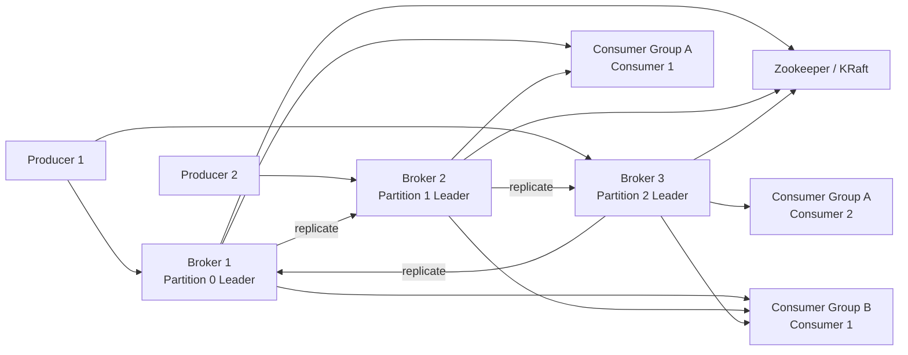
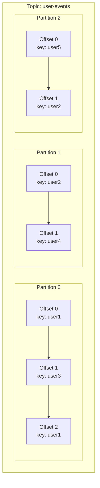
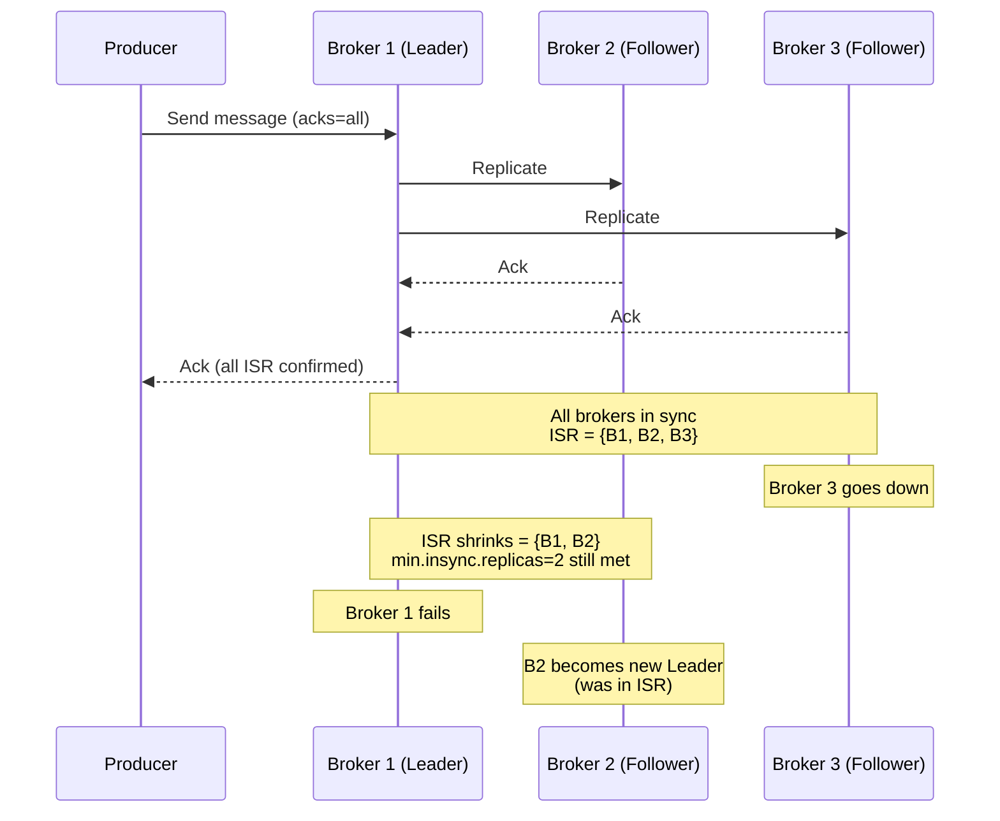
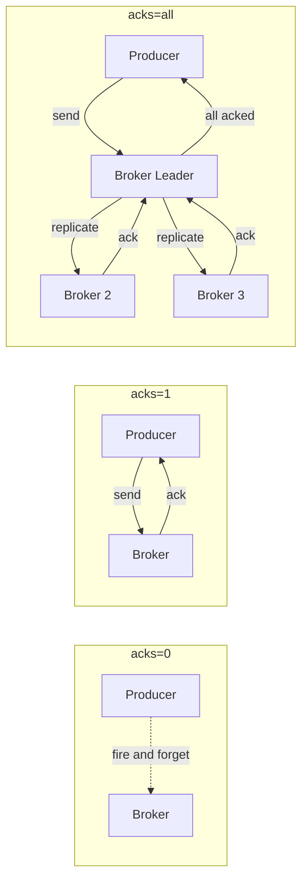
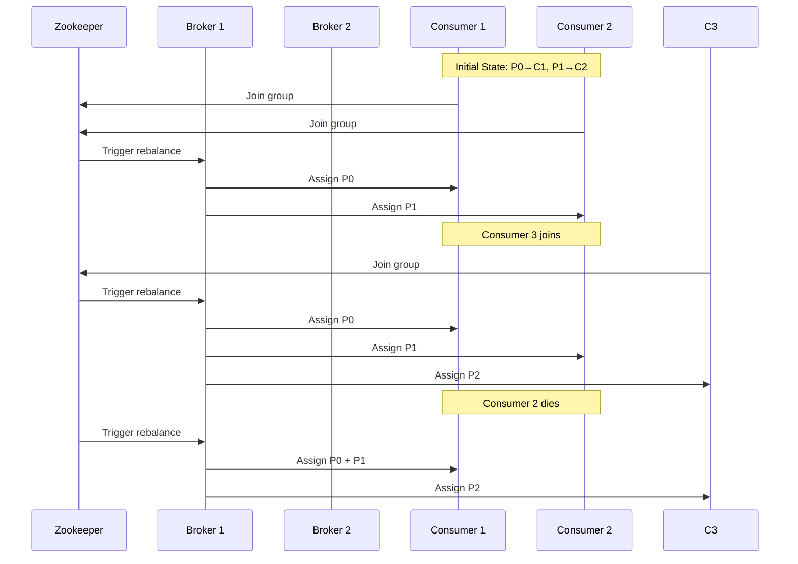
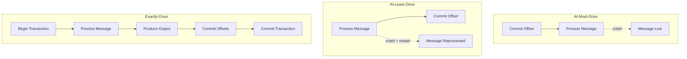
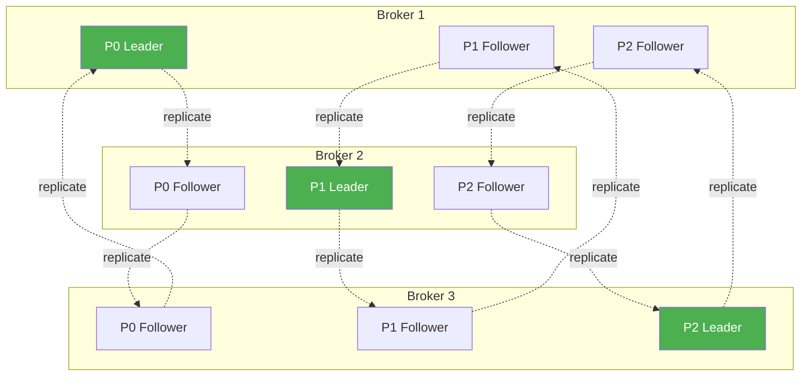
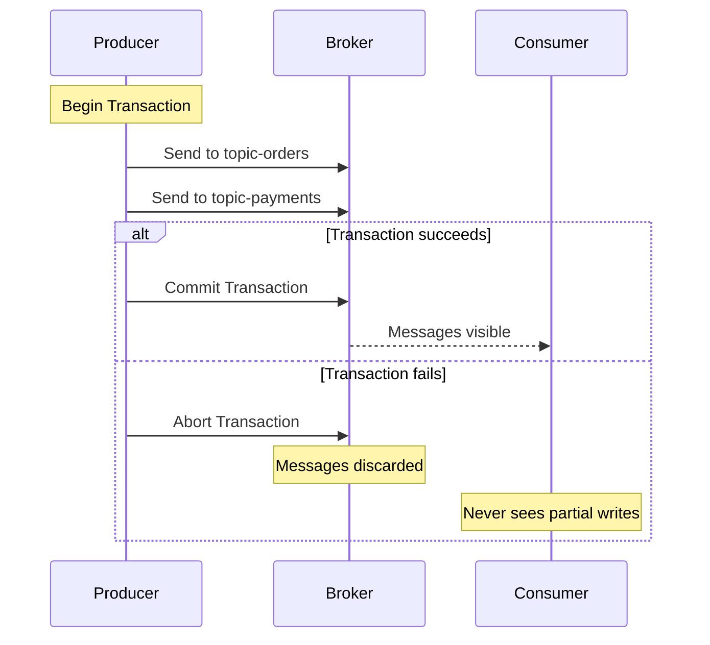
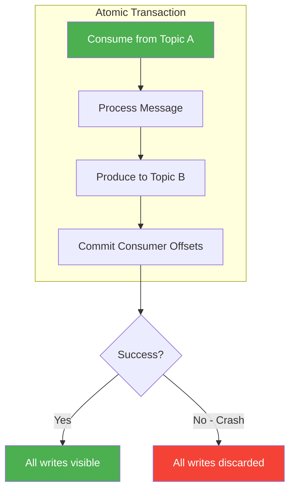

# Kafka
[get started](https://kafka.apache.org/42/getting-started/introduction/)
Kafka is distributed, event-store, real time streaming platform

Producer to broker
broker store and manage

then goes to consumer group based on needs

consider it as a chain reaction mechanism
real time analytics

## Core Kafka Concepts

### What is Kafka?
1. **Definition:** Kafka is a distributed, durable, high-throughput publish-subscribe event streaming platform used for real-time pipelines and streaming apps.
2. **Why it matters:** scales to millions of events/sec, persists events on disk, and lets independent producers & consumers decouple systems.
3. **Top use cases:** event sourcing, log aggregation, activity tracking, metrics and monitoring pipes, real-time analytics, change data capture (CDC), ML feature streams, data integration between microservices and data warehouses.

### Kafka Architecture Overview



## Message

piece of data handled
3 parts: Headers(Topics & Partitions), Key, Value

## Topics, Partitions, and Offsets

messages are organised into topics

within each topic kafka goes a step further by dividing into partitions
they allow messages to be processed parallely across multiple consumers to achieve high throughput

handles multiple producers, consumers very efficiently independently
allows to store messages even after they are being consumed with time or size limit

scalable

**Topic:** logical category or stream name (like a "channel").
**Partition:** each topic is split into partitions; each partition is an ordered, immutable sequence of messages (the log). Partitions enable horizontal scaling and parallel consumers.
**Offset:** the sequence number of a message in a partition, used by consumers to remember where they are.

### Topic → Partition → Offset



> **Why it matters:** partitions determine parallelism and ordering (ordering guaranteed *per partition*). Choose partition keys and partition count carefully for throughput and ordering guarantees.
> **Interview tip:** explain tradeoffs, too few partitions limits throughput; too many increases broker metadata and potential rebalancing complexity.

## Brokers, Zookeeper, Replication & ISR

**Brokers** are Kafka server processes. Brokers together form a cluster.
Each partition has one **leader** that handles all reads/writes for that partition; the other replicas are **followers** which replicate the leader.

**Zookeeper** manages and coordinates Kafka brokers in a cluster. ZooKeeper notifies all nodes when the topology of the Kafka cluster changes. E.g. when brokers and topics are added or removed or when a broker goes down or comes back to running state.

**Replication factor** (topic level) defines how many copies of each partition exist on different brokers, common production value is 3 for high availability.

**ISR (In-Sync Replicas)**: followers that have caught up to leader, only ISRs are eligible to become leader on failover.

### ISR Replication Flow



> **Why it matters:** replication and ISR provide durability and failover. Leadership election and replication latency influence availability and consistency.
> `acks` defines **when a producer treats a message as successfully written**.
> `**acks=0**`: Producer doesn't wait for any response. Fastest, but messages can be lost silently.
> `**acks=1**` : Leader broker confirms the write. Moderate durability, but data loss possible if leader crashes before replication.
> `**acks=all**` **(**`**acks=-1**`**) :** Leader waits for **all ISR replicas** to acknowledge. Strong durability, has higher latency.

### acks Comparison



## Producers

application that create and send messages to kafka
batch messages together to cut down network traffic
use partitioners to deduce which partitions a message should go to

messages are randomly divided across partitions

Configs of interest: `acks` (0,1,all), `retries`, `batch.size`, `linger.ms`, and `compression`.

## Consumers

receiving end
consumers in consumer group share responsibility for processing messages from different partitions in parallel
each partition is assigned to only 1 consumer within a group
if a consumer fails, another automatically takes over for uninterrupted processing

kafka auto handles them
when a consumer joins/leaves a group, kafka triggers a rebalance to redistribute partitions among remaining consumers.

### Consumer Group Rebalance



**Consumer:** reads messages. Consumers usually belong to **consumer groups**, where each partition is consumed by exactly one group member, enabling scaling of processing.
**Ordering:** Kafka guarantees order only within a partition. Use message keys to control partition assignment so that related events land on the same partition to preserve order.

## Consumer Groups, Offsets and Commits

**Offsets & commits:** an *offset* is a message's position inside a partition. Committing an offset tells Kafka ("I, consumer-group X, have processed up to offset Y"), committed offsets are stored in `__consumer_offsets` and are used to resume after crashes/rebalances. Commit can be **auto** (interval-based, easy but unsafe) or **manual** (explicit, safe but more work).

### How commit timing defines delivery semantics:



- **At-most-once:** commit *before* processing → fast, no duplicates, **may lose messages**.
- **At-least-once:** commit *after* successful processing → no loss, **duplicates possible**; make consumers idempotent or dedupe.
- **Exactly-once (practical):** requires Kafka features (idempotent producers + transactions) to get *exactly-once within Kafka pipelines*. Achieving true exactly-once **across Kafka and external systems (DBs/APIs)** is hard, use at-least-once + idempotent/deduped writes (e.g., `INSERT ... ON CONFLICT DO NOTHING`) or external transactional coordination.

### Key tools & patterns:
- **Idempotent producer** prevents duplicate writes from retries (producer-side).
- **Transactional producer** (read → process → write → commit offsets atomically) gives atomicity *within* Kafka.
- **Consumer-side strategies**: make processing idempotent, use dedup keys, or enforce DB constraints for deduplication.

## Retention

Defines how long Kafka keeps messages, independent of consumption. Kafka is a log, not a queue, messages are not deleted after being consumed.

### Deletion is based on:
- **Time** (`retention.ms`, `log.retention.hours`)
- **Size** (`retention.bytes`, `log.retention.bytes`)

Old **log segments** are deleted when limits are reached.

Even unread messages are deleted once retention expires.

**Use retention for:** Event streams, logs, metrics, clickstream, append-only data where history matters.

Consumers do **not** control deletion, **retention policies do**.

### Retention Strategies

```mermaid
graph TB
    subgraph "Time-Based Retention"
        T1[Message t=0] --> T2[Message t=1hr]
        T2 --> T3[Message t=2hr]
        T3 --> T4[Message t=3hr]
        T3 -->|retention.ms=7200000| T5[Deleted]
    end

    subgraph "Size-Based Retention"
        S1[Message 1KB] --> S2[Message 1KB]
        S2 --> S3[Message 1KB]
        S3 --> S4[Message 1KB]
        S4 -->|retention.bytes=4KB| S5[Oldest Deleted]
    end

    subgraph "Log Compaction"
        L1[key=A, val=1] --> L2[key=B, val=2]
        L2 --> L3[key=A, val=3]
        L3 --> L4[key=B, val=4]
        L4 --> L5[key=A, val=5]
        L5 -->|compacted| L6[key=A, val=5<br/>key=B, val=4]
    end
```



## Log Compaction

Keeps only the latest value for each message key in a topic. `cleanup.policy=compact`

Cleanup is based on **keys**, not time

Requires messages to have **keys**

Older records with the same key are removed asynchronously.

**Use Log Compaction for:** Enables Kafka to behave like a **persistent key-value store, User Profiles, Account Balances, Inventory Counts, Feature Flags.**

Critical for: Changelogs, materialized Views, State Recovery, CDC Pipelines.

> Compaction removes data immediately → **False** (async & incremental)
> Retention and compaction are exclusive → **False**

### Tombstones (important)
1. To delete a key, producer sends `(key, value=null)`
2. Kafka removes all old records for that key
3. Tombstone itself is removed after `delete.retention.ms`

## Cluster

kafka cluster is made up of multiple brokers
servers that store and manage our data
to keep data safe each partition is replicated across several brokers using a leader-follower model
if 1 fails, another steps in as new leader without losing any data

## Best Practice (Production Setup)
`replication.factor=3, acks=all, min.insync.replicas=2, unclean.leader.election.enable=false`

### Production Cluster Layout



> Green = Leader, Gray = Follower. Each partition has 1 leader + 2 followers across 3 brokers.

# APIs

4 apis: Producer, Consumer, Streams, Connector

## Hands-On Setup

### Docker Compose (local dev)

```bash
docker compose up -d
```

This starts Zookeeper + Kafka on `localhost:9092`.

### Node.js / TypeScript

```bash
npm init -y
npm install kafkajs
npm install -D typescript @types/node ts-node
npx ts-node index.ts
```

### Files

- `config.ts` — Kafka client, producer, consumer, and topic configuration
- `index.ts` — Producer, consumer, admin, and transaction examples
- `docker-compose.yml` — local Kafka cluster

## Important Interview Questions

1. **How to ensure message ordering?** Use keys so related messages hash to same partition. Kafka guarantees ordering within same partition. Kafka hashes the key and always routes message with same key to same partition.
2. **How to scale Kafka consumers?** Increase partitions and run more consumers in the same group (max parallelism = partitions).
3. **How to achieve exactly once to downstream systems?** Typically requires idempotence on downstream or two-phase/transactional coordination (Kafka transactions + idempotent consumers + external system support). Enable idempotent producer, use Kafka transactions, use read_committed consumers which guarantees that message is written and processed only once within Kafka.
4. **How to monitor consumer lag?** Compare group offset (committed) with topic end offset (LogEndOffset), many monitoring stacks expose this. *Lag = Latest message in partition — Last processed message by consumer.*
5. **How to secure Kafka?** Use TLS, SASL (SCRAM/PLAIN/OAUTH), ACLs, network segmentation.
6. **How to do schema evolution safely?** Use Schema Registry and compatibility rules (BACKWARD, FORWARD, FULL). Data formats: Avro / Protobuf / JSON

### Compatibility modes:
1. **BACKWARD**: New consumers can read old data (recommended)
2. **FORWARD**: Old consumers can read new data
3. **FULL**: Both backward and forward compatible

---

## Senior-Level Interview Scenarios

### Q1: Consumer Lag Growing to Millions

**Problem:** Consumer lag is continuously growing and has reached millions of messages. The consumer is falling behind the producer.

**Root Causes:**
- Consumer processing is too slow (external API calls, DB writes per message)
- Partitions are unevenly distributed or too few
- Consumer group has fewer instances than partitions
- Single partition hot-spot (all messages keyed the same)

**Solutions:**
1. **Increase consumer parallelism** — add more consumers (up to partition count)
2. **Increase partitions** — more partitions = more parallel consumers
3. **Batch processing** — process messages in batches instead of one-by-one
4. **Async downstream writes** — don't block on DB/API per message
5. **Tune `max.poll.records`** — increase records per poll batch
6. **Check consumer code** — profile for blocking calls, slow serialization

**Monitoring:**
```
Lag = LogEndOffset - CommittedOffset
```
Use tools like Burrow, Kafka Lag Exporter, or Confluent Control Center.

---

### Q2: Messages Produced but Consumer Receives Nothing

**Problem:** Producer confirms messages are written, but consumer sees nothing.

**Root Causes:**
- Consumer is subscribed to wrong topic or wrong partition
- Consumer group already committed offsets past the new messages
- `fromBeginning: false` (default) — consumer only reads new messages, missed the batch
- Auto topic creation is disabled and topic doesn't exist
- Consumer is in a different group than expected (different `groupId`)
- Consumer is assigned to partition 0 but messages landed on partition 1

**Solutions:**
1. **Verify subscription** — `consumer.subscribe({ topic: 'correct-topic', fromBeginning: true })`
2. **Check consumer group offsets:**
   ```bash
   kafka-consumer-groups --bootstrap-server localhost:9092 \
     --describe --group my-consumer-group
   ```
3. **Reset offsets** to replay messages:
   ```bash
   kafka-consumer-groups --bootstrap-server localhost:9092 \
     --group my-consumer-group --topic my-topic \
     --reset-offsets --to-earliest --execute
   ```
4. **Check partition assignment** — `consumer.describeGroup()` to see who gets what
5. **Verify topic exists** — `kafka-topics --list --bootstrap-server localhost:9092`

---

### Q3: Why Does Consumer Reprocess Old Messages After Restart?

**Problem:** Consumer restarts and replays messages it already processed.

**Root Causes:**
- **Auto-commit enabled** — offsets committed periodically, crash happened between commits
- **Manual commit not implemented** — processing succeeded but offset wasn't committed
- **`fromBeginning: true`** with no committed offset in the group
- **Consumer group was reset/recreated** — new group has no offset history
- **Session timeout too short** — broker thinks consumer is dead, rebalances, new consumer starts from beginning

**Solutions:**
1. **Commit offsets after processing** (at-least-once):
   ```typescript
   await consumer.run({
     eachMessage: async ({ message }) => {
       await processMessage(message);  // process first
       await consumer.commitOffsets([{  // then commit
         topic, partition, offset: (Number(message.offset) + 1).toString()
       }]);
     }
   });
   ```
2. **Enable idempotent processing** — handle duplicates gracefully
3. **Use Kafka transactions** for exactly-once within Kafka
4. **Increase `session.timeout.ms`** if consumer legitimately takes time
5. **Track processed offsets externally** (Redis, DB) for deduplication

**Delivery Semantics Recap:**
| Pattern | Commit Timing | Risk |
|---------|--------------|------|
| At-most-once | Before processing | May lose messages |
| At-least-once | After processing | May duplicate |
| Exactly-once | Transactional | Complex, Kafka-only |

---

### Q4: Why One Consumer Is Overloaded While Others Are Idle?

**Problem:** In a consumer group, one consumer handles most messages while others sit idle.

**Root Causes:**
- **Poor partition key choice** — all messages hash to same partition
- **Skewed data distribution** — e.g., one user generates 90% of events
- **Fewer partitions than consumers** — some consumers get no partition assigned
- **Rebalance not triggered** — new consumer joined but partition assignment didn't update

**Solutions:**
1. **Use a better partition key** — distribute by user ID, region, or random key
2. **Increase partitions** — ensures enough partitions for all consumers
3. **Custom partitioner:**
   ```typescript
   const producer = kafka.producer({
     createPartitioner: Kafka.Partitioners.DefaultPartitioner,
   });
   // Or implement custom partitioner for even distribution
   ```
4. **Check partition count:**
   ```bash
   kafka-topics --describe --topic my-topic --bootstrap-server localhost:9092
   ```
5. **Monitor partition assignment:**
   ```bash
   kafka-consumer-groups --describe --group my-group --bootstrap-server localhost:9092
   ```
6. **Consider message batching** — if one consumer is slow, batch its partition's messages

---

### Q5: Why Producer Throughput Drops Under Load?

**Problem:** Producer works fine at low volume, but throughput degrades as load increases.

**Root Causes:**
- **`acks=all` with slow ISR** — waiting for all replicas is slow
- **`linger.ms` too low** — sending too many small batches
- **`batch.size` too small** — messages fragmented into many requests
- **`max.in.flight.requests.per.connection` too low** — not enough parallel requests
- **Network saturation** — broker or network at capacity
- **Compression overhead** — CPU-bound compression at high throughput
- **Broker disk I/O bottleneck** — slow disk can't keep up with writes

**Solutions:**
1. **Tune batching:**
   ```typescript
   linger: 5,           // wait 5ms to fill batch
   batch.size: 65536,   // 64KB batch size
   compression: 1,      // gzip (or 3 for lz4, faster)
   ```
2. **Increase `max.in.flight.requests.per.connection`** to 5 (default) or higher
3. **Use `acks=1`** if durability can tolerate it (faster than `acks=all`)
4. **Scale brokers** — add more brokers to distribute load
5. **Use faster disks** — SSDs for broker log segments
6. **Profile the producer:**
   ```bash
   kafka-producer-perf-test --topic test --num-records 1000000 \
     --record-size 1024 --throughput -1 \
     --producer-props bootstrap.servers=localhost:9092
   ```
7. **Check broker metrics** — `RequestQueueSize`, `NetworkProcessorAvgIdlePercent`

---

### Q6: Kafka Is Up, But Producers Keep Timing Out — Why?

**Problem:** Kafka broker is running, but producers get timeout exceptions and can't send messages.

**Root Causes:**
- **Broker under heavy load** — request queue full, can't respond in time
- **`request.timeout.ms` too low** — producer gives up before broker responds
- **`linger.ms` + `batch.size` mismatch** — batch too large, broker can't process fast enough
- **Under-replicated partitions** — broker waiting for ISR that's slow or down
- **Network issues** — latency between producer and broker
- **Zookeeper/KRaft issues** — metadata not available, broker in controller election
- **Disk full** — broker can't write to log segments

**Solutions:**
1. **Increase timeouts:**
   ```typescript
   // Producer config
   requestTimeout: 30000,  // 30s (default 40s)
   transactionTimeout: 60000,
   ```
2. **Check broker health:**
   ```bash
   kafka-broker-api-versions --bootstrap-server localhost:9092
   kafka-topics --list --bootstrap-server localhost:9092
   ```
3. **Monitor broker metrics:**
   - `RequestQueueSize` — should be 0
   - `NetworkProcessorAvgIdlePercent` — should be > 0.3
   - `UnderReplicatedPartitions` — should be 0
4. **Check ISR health:**
   ```bash
   kafka-topics --describe --topic my-topic --bootstrap-server localhost:9092
   # Look for "Isr:" list — should match "Replicas:" list
   ```
5. **Ensure `min.insync.replicas` is reachable** — if ISR shrinks below this, `acks=all` will fail
6. **Check disk space and I/O:**
   ```bash
   df -h /var/lib/kafka/data
   iostat -x 1
   ```
7. **Scale broker resources** — CPU, memory, network, disk

---

## Kafka Transactions

Kafka transactions allow a producer to write messages to multiple partitions and/or multiple topics atomically.

> *Atomic* means:
> - **All writes succeed together**, or
> - **None of them are visible** to consumers

### Why transactions is needed?



Consider a processing pipeline:
Topic A → Consumer/Processor → Topic B + Topic C

Without transactions:
1. Message might be written to **Topic B**
2. Crash happens before writing to **Topic C**
3. System is left in an **inconsistent state**

With transactions:
1. Writes to **Topic B and Topic C** happen in a **single transaction**
2. If the process crashes → Kafka **aborts the transaction**
3. Consumers never see partial results

### Atomic writes to multiple Partitions/Topics

Either **all messages are committed** or **none are visible** if a failure occurs.

```
BEGIN TRANSACTION
  write message to topic-orders partition 1
  write message to topic-payments partition 3
  write message to topic-notifications partition 0
COMMIT TRANSACTION
```

### How transactions relate to Exactly-Once Semantics

Kafka transactions enable **exactly-once processing** **within Kafka:**

```
Consume from Topic A
Produce to Topic B
Commit consumer offsets
All in one atomic transaction
```

If a crash occurs:
- Output messages are discarded
- Offsets are not committed
- Message is safely reprocessed

### Exactly-Once Transaction Flow



### Tradeoffs

Higher latency, More network round trips, More complex error handling, Harder debugging, Broker overhead

### Why "idempotent writes + downstream dedup" may be simpler

In many real systems:
1. Consumer may reprocess messages
2. Duplicate writes can happen
3. Instead of transactions, you:
   - Make downstream writes **idempotent**
   - Use **unique keys / constraints**
   - Deduplicate at DB or service layer

```sql
INSERT INTO orders(id, data) ON CONFLICT (id) DO NOTHING;
```

This achieves **effectively-once behavior** without Kafka transactions.

[interview prep](https://x.com/i/status/2006733716614426850)